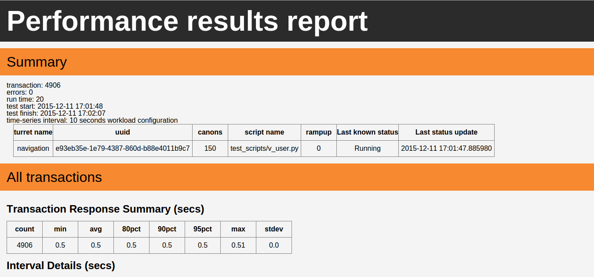

Collecting the results
======================

The tests have ended and the report has been created ? Let's take a look at it !

Results.html file
-----------------

This is the main and the more explicit part of the results, it will give you all major information about the tests, plus
some graphs to help you read the results.

A default result page looks like this :

For each custom timer, a section will be created (like the "All transactions" section) and the associated graphs will be created.

The graphs are currently in SVG format and use javascript to make reading and interpretating the result easier.

Regenerate results
------------------

Sometimes you may need to regenerate the html report with all graphs from an sqlite file.
OCT got a tool that allows you to do this.

You can simply use the ``oct-rebuild-results`` like this for example:

.. code-block:: bash

    oct rebuild-results . results.sqlite config.json

.. note::

    The oct-rebuild-results command will only work on an already created results folder that contains only the sqlite results
    and optionnaly the configuration.
