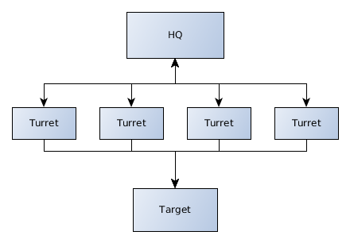

Introduction
============

Terminology
-----------

* HQ for Headquarters: it's the "server" component of OCT and it's tasked with sending start signal, stop signal, collecting results and create reports
* Turret: a turret is the "client" component of OCT. It can be writen in any language and it communicates with the HQ using a zeromq PUSH socket. Each turret owns one or many canons.
* Canons: represent the virtual users, wich means that each canon of the turret will run a test in parallel

.. note::
    Why do we use this terminology ? It gives a good idea of what's happening
    when you use OCT. Think about it like that : each turret owns X canons that
    shoot at the target and report on the result to the HQ

What is OCT
-----------

OCT is an agnostic load testing tool. What do we mean by agnostic ? It's simple : OCT provides only the needed tools
to distribute and run your tests and compile the results. But the tools and programming languages for writing 
the tests themselves are up to you.

At this stage of development we only offer a python turret, but if you want to create your own turret implementation
in any language, please do it ! We're really open to any suggestions and help.

How it works ?
--------------

OCT uses the power of ``zeromq`` to distribute test on any number of physical machines you need. When running a test the process is very simple :

* OCT starts the HQ. It sends a start message to the turrets and will later collect their results
* The turrets receive the message, start the tests and send results to the HQ
* When the test ends, the HQ sends a stop message to the turrets and process the remaining messages in queue
* OCT will then compile the results and create a html report of them

Want a graph ? Here you go :

So this is it, a bunch of turrets shooting at the target and sending information to the HQ.
