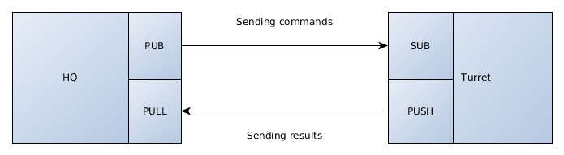

Writing your own turret
=======================

So that's it, you use OCT but the python turret doesn't fit your needs ? Or you need a library avaible only on one
language ? Or maybe you just want to create a turret with your favorite programing language ? No problem, this guide is here
for you !

.. note::
    You can base your turret on the python turret, source code avaible `here`_

.. _here: https://github.com/karec/oct-turrets

Global workflow
---------------

OCT use zeromq for communicate between the HQ and the turrets. That's mean that you can write a turret in any language
who have a zeromq binding (`zeromq bindings`_)

.. _zeromq bindings: http://zeromq.org/bindings:_start

But before starting to code, you need to understand how the turrets must communication with the HQ. Here is a schema to explain it :

So as you can this is pretty simple, the HQ send orders to the turrets using a PUB/SUB pattern, and the turrets will send
results to the master using a PUSH/PULL pattern.

.. note::
    The python turret also use a push/pull pattern to enable communication between canons and the turret itself. All canons
    have an inproc turret connected to the turret process

Requirements
------------

Before going any further, you need to know what a turret must be able to do :

* Reading a turret configuration file (see below)
* Spawning N number of canons (set in the configuration file)
* Managing rampup
* Importing test files and run it
* Sending well formated json message to the HQ

The turret configuration
------------------------

Has you can see in the python-turret example (in the github repository), a turret must be able to read and understand this
type of configuration file :

.. code-block:: json

    {
        "name": "navigation",
        "canons": 50,
        "rampup": 10,
        "script": "v_user.py",
        "hq_address": "127.0.0.1",
        "hq_publisher": 5000,
        "hq_rc": 5001
    }

Has you can see the configuration is pretty simple and yes this is the full configuration need for a turret to run.

Let's explain all keys :

* ``name``: the display name of the turret for the report
* ``canons``: the number of canons to spawn(remember, canons == virtual users)
* ``rampup``: the rampup value in seconds
* ``script``: the path/name of the test script to load
* ``hq_address``: the ip address of the HQ
* ``hq_publisher``: the port of the PUB socket of the HQ
* ``hq_rc``: the port of the PULL socket of the HQ

Obviously you will need all this informations

Sockets configuration
---------------------

HQ commands format
------------------

Differents HQ orders
--------------------

Tell the HQ that your turret is ready to fire
---------------------------------------------

Don't forget to update your turret status
-----------------------------------------

Messages format
---------------

Error management
----------------

In case of turret destruction
-----------------------------

Writing your own packaging system
---------------------------------

Document your turret
--------------------
